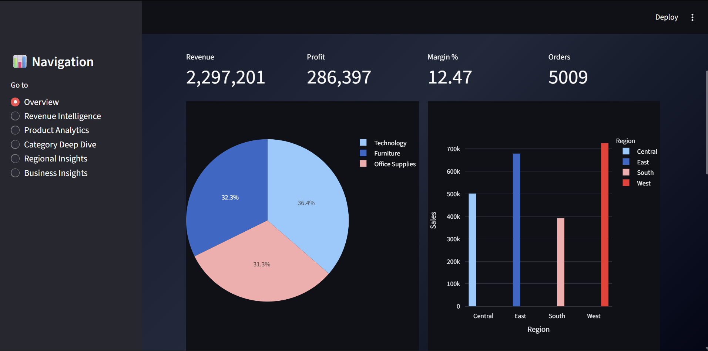
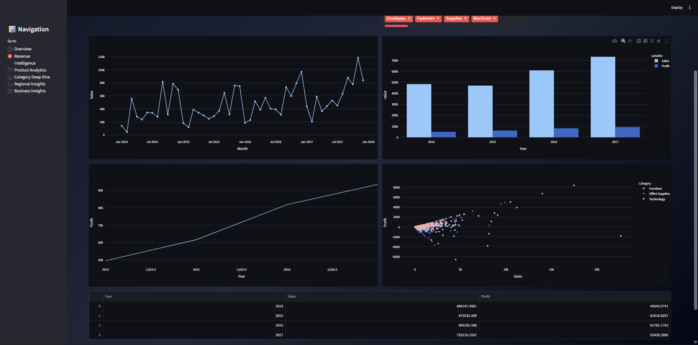
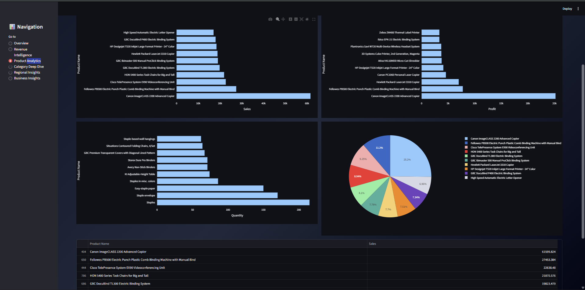
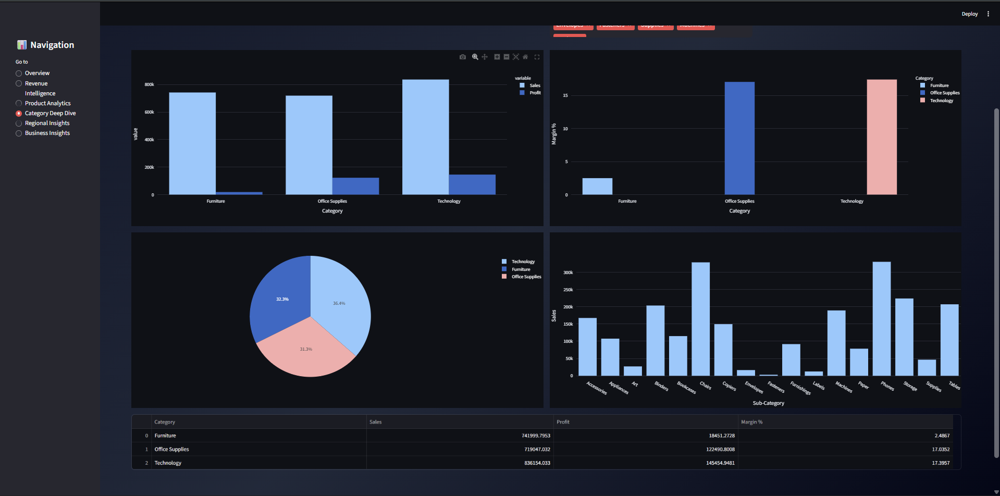
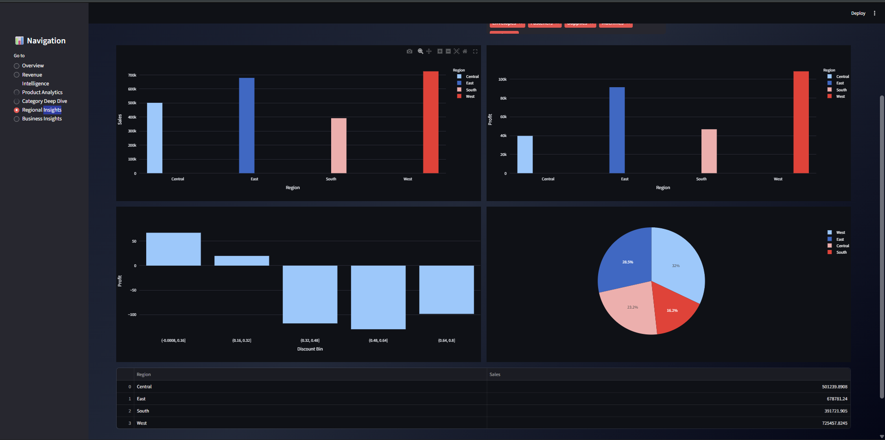
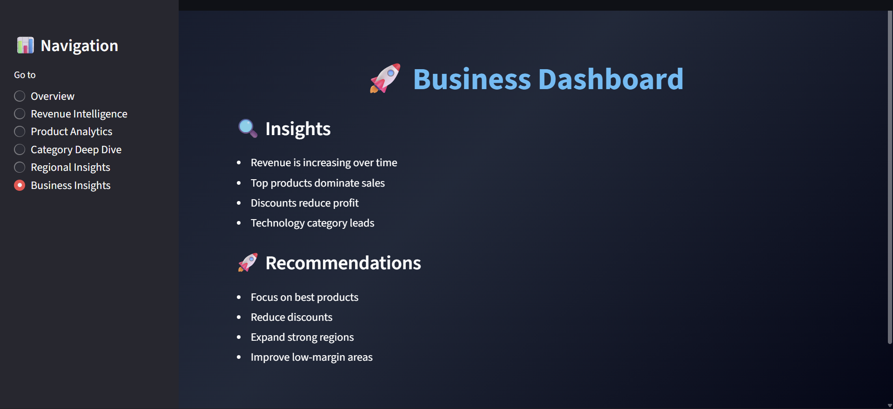

# 📊 Business Sales Analytics Dashboard

**Future Interns – Data Science & Analytics Internship · Task 1 · 2026**

### 🖥️ Dashboard Preview

| Overview | Revenue |
|:---:|:---:|
|  |  |

| Products | Categories |
|:---:|:---:|
|  |  |

| Regions | Insights |
|:---:|:---:|
|  |  |

> Transforming raw sales data into actionable business insights using an interactive multi-page dashboard.

---

## 🗂️ Project Structure

FUTURE_DS_01/

│

├── app.py

├── requirements.txt

├── README.md

├── data/

│ └── Sample - Superstore.csv

├── screenshots/

│ ├── overview.png

│ ├── revenue.png

│ ├── products.png

│ ├── categories.png

│ ├── regions.png

│ └── insights.png

---

## 🚀 Live Dashboard

👉 [Click Here to View Live App]((https://futureds01.streamlit.app/))

---

## ⚡ Features

- 📊 Multi-page interactive dashboard  
- 🔍 Advanced filters (Region, Category, Date, Sub-category)  
- 📈 Revenue trend analysis  
- 🏆 Top-performing products  
- 📦 Category & sub-category breakdown  
- 🌍 Regional performance insights  
- 💡 Business insights & recommendations  

---

## 📈 Key Metrics

| Metric | Description |
|------|-------------|
| 💰 Revenue | Total sales generated |
| 📈 Profit | Net profit |
| 📊 Profit Margin | Profitability percentage |
| 📦 Orders | Total number of orders |

---

## 🎨 Dashboard Sections

| Section | Description |
|--------|------------|
| 🏠 Overview | KPI metrics + summary |
| 📈 Revenue Intelligence | Sales trends |
| 🏆 Product Analytics | Product performance |
| 📊 Category Deep Dive | Category analysis |
| 🌍 Regional Insights | Region analysis |
| 💡 Business Insights | Insights & recommendations |

---

## 💡 Key Insights

- 📈 Sales show consistent growth trends  
- 🏆 Top products drive major revenue  
- 📉 High discounts reduce profitability  
- 🌍 Some regions outperform others  
- 📊 Technology category leads  

---

## 🛠️ Tech Stack

- Python  
- Streamlit  
- Pandas  
- Plotly  

---

## ▶️ Run Locally

pip install -r requirements.txt
streamlit run app.py
📤 Deliverables
✅ Interactive dashboard
✅ Multi-page navigation
✅ Business insights
✅ Clean structure
✅ GitHub documentation

🚀 Built with passion for Data Analytics · Future Interns 2026

